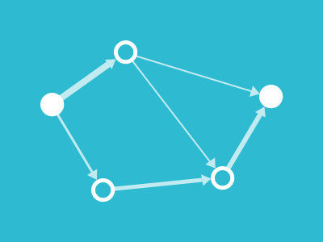

# Data Structures and Algorithms



## Table of Contents

- [Overview](#overview)
- [Repository Structure](#repository-structure)
- [How to Use](#how-to-use)
- [Contributing](#contributing)
- [Online Resources](#online-resources)
- [Disclaimer](#disclaimer)
- [License](#license)

## Overview

Comprehensive C++ implementations of Data Structures and Algorithms (DSA) for coding challenges, problem-solving, and interview preparation. The repository includes well-commented code with examples and time-space complexity analysis.

## Repository Structure

The repository is organized into the following sections:

### Basics and Fundamentals
- **1_BasicsOfProg** - Introduction to programming basics
- **3_BasicsOfProg2** - Advanced programming fundamentals
- **11_BasicMaths_and_Pointers** - Mathematical concepts and pointer operations

### Data Structures
- **5_Arrays** - Array operations and manipulations
- **9_CharArrays_and_Strings** - String manipulation and algorithms
- **19_Linked_Lists** - Singly and doubly linked list implementations
- **21_Stacks** - Stack implementations and applications
- **24_Queue** - Queue implementations and applications
- **26_Trees** - Tree data structures and traversal algorithms
- **28_BST** - Binary Search Tree operations and algorithms
- **31_Heaps** - Min-heap and max-heap implementations
- **33_Maps_and_Tries** - Map implementations and Trie data structure

### Algorithms
- **7_Searching_Sorting** - Various searching and sorting algorithms
- **14_Recursion_and_Backtracking** - Recursive and backtracking algorithms
- **16_DnC_TC_and_SC** - Divide and Conquer, Time and Space Complexity
- **35_DP1** - Dynamic Programming fundamentals
- **36_DP2** - Advanced Dynamic Programming
- **38_Graphs1** - Basic graph algorithms
- **39_Graphs2** - Advanced graph algorithms
- **41_GreedyAlgorithm** - Greedy approach solutions
- **42_SlidingWindow** - Sliding window technique implementations
- **43_BitManipulation** - Bit-level operations and optimizations

### Programming Paradigms and Concepts
- **18_OOPs** - Object-Oriented Programming concepts

### Practice
- **13_Contest1** - Contest problems and solutions
- **23_Contest2** - Advanced contest problems and solutions
- **LeetCode** - Solutions to LeetCode problems

### Weekly Assignments
- **2_Week1_Assignments**
- **4_Week2_Assignments**
- **6_Week3_Assignments**
- **8_Week4_Assignments**
- **10_Week5_Assignments**
- **12_Week6_Assignments**
- **15_Week7_Assignments**
- **17_DnC_Backtracking_Assignments**
- **20_Linked_Lists_Assignments**
- **22_Stacks_Assignments**
- **25_Queue_Assignments**
- **27_Trees_Assignments**
- **32_Heaps_Assignments**
- **34_Maps_and_Tries_Assignments**
- **37_DP_Assignments**
- **40_Graphs_Assignments**

## How to Use

1. Clone the repository:
```bash
git clone https://github.com/manankumar7403/Data-Structures-and-Algorithms.git
cd Data-Structures-and-Algorithms
```

2. Run C++ Code:
    - You can use VS Code with the Code Runner extension, as the repo is structured for that.

    - Alternatively, you can use:

        - OnlineGDB / Replit / GeeksforGeeks IDE

        - Or compile locally:
            ```bash
            g++ filename.cpp -o filename
            ./filename
            ```

3. Navigate to your topic of interest and run the .cpp file.


## Contributing

Contributions are welcome! Please:
1. **Fork** the repository.
2. Create a **new branch**:  
   ```bash
   git checkout -b new-feature
   ```
3. Make changes and commit:
   ```bash
   git commit -m "Added XYZ Algorithm"
   ```
4. Push to the branch
   ```bash
   git push origin new-feature
   ```
5. Open a pull request.

**Report issues via [GitHub Issues](https://github.com/manankumar7403/Data-Structures-and-Algorithms/issues).**


## Online Resources
- [GeeksforGeeks](https://www.geeksforgeeks.org/)
- [LeetCode](https://leetcode.com/)
- [HackerRank](https://www.hackerrank.com/)


## Disclaimer

This repository is for learning and educational use only. Ensure academic integrity and follow platform rules while using shared solutions.

## License

This project is licensed under the [MIT License](LICENSE).
